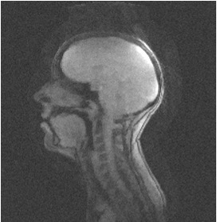
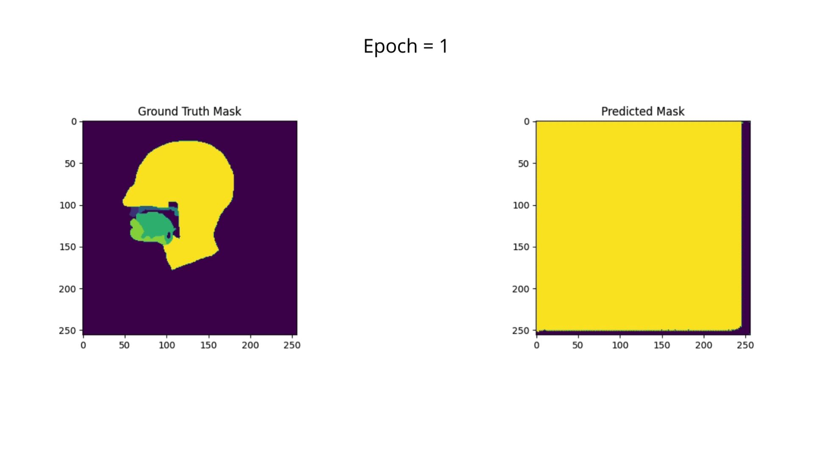

# Vocal Tract Segmentation with IMU-Net

Project for Neuroengineering course held at @Politecnico di Milano

## Overview

This project focuses on segmenting the **vocal tract** using **IMU-Net**, an improved U-Net variant designed for segmentation. The goal is to segment the vocal tract into seven distinct regions using **MRI images**:

1. Background and vocal tract
2. Upper lip
3. Hard palate
4. Soft palate
5. Tongue
6. Lower lip
7. Head

The model can assist in diagnosing speech-related disorders, such as **Apraxia of Speech** and **Dysarthria**, and evaluate **velopharyngeal closure**.

  

   
    
   <strong><em>Figure 1 – Vocal tract segmentation</em></strong>

 

## Data Preparation

- The dataset is split into **training (70%)**, **validation (20%)**, and **test (10%)** sets, stratified by patient.
- **Preprocessing** steps include denoising with gamma transformations, Gaussian filtering, and pixel thresholding.
- **Data augmentation** involves rotating, translating, and zooming to improve model generalization.

  

   
    
   <strong><em>Figure 2 – MRI before preprocessing</em></strong>

 

   
    
   <strong><em>Figure 3 – MRI after preprocessing and augmentation</em></strong>

 

## IMU-Net Architecture

The **IMU-Net** is based on the U-Net architecture with **residual blocks** in both encoding and decoding paths. This allows better feature extraction and improved segmentation results.

### Key Components:
- **Encoder**: Extracts high-level features.
- **Bottleneck**: Uses dilated convolutions to increase the receptive field.
- **Decoder**: Reconstructs fine details with skip connections.

## Training

- **Metrics**: DICE coefficient, accuracy, precision, recall, and mean IoU.
- **Loss function**: Weighted cross-entropy to prioritize underrepresented classes.
- **Optimizer**: Adam with learning rate scheduler and early stopping.

  

   
    
   <strong><em>Figure 4 – Segmentation prediction over training epochs</em></strong>

 

## Results

- Multiple trials with different hyperparameters (learning rate, batch size, epochs).
- Best model achieved with **preprocessed and augmented data**.
- Cross-validation with various patient combinations for model robustness.

## Conclusion

- The **IMU-Net** architecture successfully segments the vocal tract into seven regions.
- The model demonstrates clinical potential for diagnosing speech disorders and evaluating vocal tract conditions.
